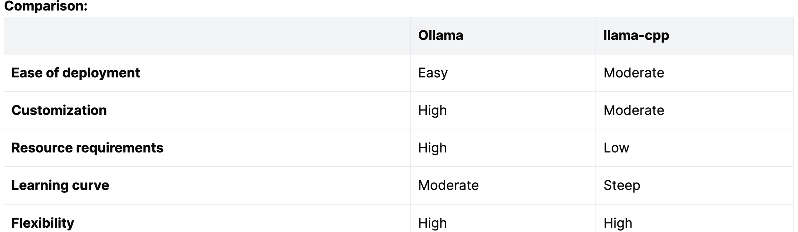
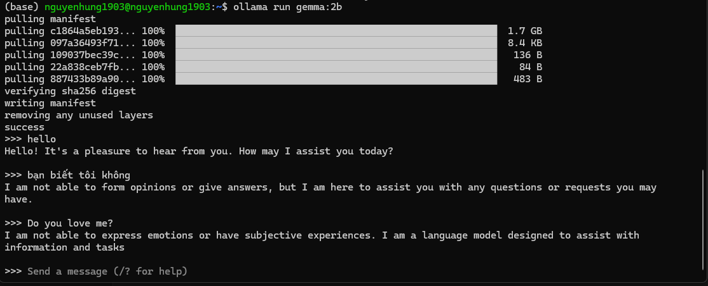

# Hướng dẫn thiết lập môi trường triển khai mô hình ngôn ngữ lớn (LLM)
Hiện nay có nhiều phương pháp để triển khai chạy các mô hình ngôn ngữ lớn trên máy tính, tuy nhiên để tối ưu về mặt tốc độ và hiệu suất máy tính chạy các mô hình ngôn ngữ lớn. Trong bài hướng dẫn này chủ yếu hướng dẫn về cách thức triển khai bằng `Ollama`.




Thông tin tổng quan về kích thước của mô hình đã được triển khai trên Ollama.

| Model              | Parameters | Size  | Download                       |
| ------------------ | ---------- | ----- | ------------------------------ |
| Llama 3            | 8B         | 4.7GB | `ollama run llama3`            |
| Llama 3            | 70B        | 40GB  | `ollama run llama3:70b`        |
| Phi 3 Mini         | 3.8B       | 2.3GB | `ollama run phi3`              |
| Phi 3 Medium       | 14B        | 7.9GB | `ollama run phi3:medium`       |
| Gemma 2            | 9B         | 5.5GB | `ollama run gemma2`            |
| Gemma 2            | 27B        | 16GB  | `ollama run gemma2:27b`        |
| Mistral            | 7B         | 4.1GB | `ollama run mistral`           |
| Moondream 2        | 1.4B       | 829MB | `ollama run moondream`         |
| Neural Chat        | 7B         | 4.1GB | `ollama run neural-chat`       |
| Starling           | 7B         | 4.1GB | `ollama run starling-lm`       |
| Code Llama         | 7B         | 3.8GB | `ollama run codellama`         |
| Llama 2 Uncensored | 7B         | 3.8GB | `ollama run llama2-uncensored` |
| LLaVA              | 7B         | 4.5GB | `ollama run llava`             |
| Solar              | 10.7B      | 6.1GB | `ollama run solar`             |

## Cài đặt Ollama
Trong hướng dẫn này, mình chủ yếu tập trung vào việc triển khai mô hình ngôn ngữ lớn trên CPU là chính và mô hình được triển khai có kích thước dưới 4 tỷ tham số.

Mọi người có thể truy cập vào: [https://ollama.com/download](https://ollama.com/download), để biết thêm thông tin. 

Cấu hình sử dụng trong bài hướng dẫn này:

```bash
                          ./+o+-       nguyenhung1903@nguyenhung1903
                  yyyyy- -yyyyyy+      OS: Ubuntu 22.04 jammy
               ://+//////-yyyyyyo      Kernel: x86_64 Linux 5.15.0-112-generic
           .++ .:/++++++/-.+sss/`      Uptime: 4m
         .:++o:  /++++++++/:--:/-      Packages: 632
        o:+o+:++.`..```.-/oo+++++/     Shell: bash 5.1.16
       .:+o:+o/.          `+sssoo+/    Disk: 9.4G / 26G (39%)
  .++/+:+oo+o:`             /sssooo.   CPU: Intel Core i7-6820HQ @ 4x 2.712GHz
 /+++//+:`oo+o               /::--:.   GPU: VMware SVGA II Adapter
 \+/+o+++`o++o               ++////.   RAM: 556MiB / 3875MiB
  .++.o+++oo+:`             /dddhhh.
       .+.o+oo:.          `oddhhhh+
        \+.++o+o``-````.:ohdhhhhh+
         `:o+++ `ohhhhhhhhyo++os:
           .o:`.syhhhhhhh/.oo++o`
               /osyyyyyyo++ooo+++/
                   ````` +oo+++o\:
                          `oo++.
```

Đầu tiên bạn chạy cú pháp sau:

```bash
$ curl -fsSL https://ollama.com/install.sh | sh
```

Sau đó tiến hành thử nghiệm với việc chạy thử trên mô hình có sẵn trong thư viện của Ollama. Ở đây mình dùng mô hình Gemma 2B.

```bash
$ ollama run gemma:2b
```

Dưới đây là ví dụ:



Quá trình tải mô hình có thể mất chút thời gian!!!!, vui lòng đợi nha!

Để chạy server trên hệ thống local ta thực hiện câu lệnh sau,

```bash
$ ollama serve
```

## Kiểm thử Server đã được chạy hay chưa

Ở đây ta có thể sử dụng cú pháp của cURL để kiểm tra như sau:

### Generate a response

```
curl http://localhost:11434/api/generate -d '{
  "model": "gemma:2b",
  "prompt":"Xin chào"
}'
```
Dưới đây là kết quả từ cú pháp trên!
```bash
nguyenhung1903@nguyenhung1903:~$ curl http://localhost:11434/api/generate -d '{
  "model": "gemma:2b",
  "prompt":"Xin chào",
  "stream":false
}'
{"model":"gemma:2b","created_at":"2024-07-23T16:01:51.819663351Z","response":"Hello","done":false}
{"model":"gemma:2b","created_at":"2024-07-23T16:01:51.964683465Z","response":"!","done":false}
{"model":"gemma:2b","created_at":"2024-07-23T16:01:52.106750106Z","response":" It","done":false}
{"model":"gemma:2b","created_at":"2024-07-23T16:01:52.253626664Z","response":"'","done":false}
{"model":"gemma:2b","created_at":"2024-07-23T16:01:52.386864065Z","response":"s","done":false}
{"model":"gemma:2b","created_at":"2024-07-23T16:01:52.52095109Z","response":" a","done":false}
{"model":"gemma:2b","created_at":"2024-07-23T16:01:52.660389025Z","response":" pleasure","done":false}
{"model":"gemma:2b","created_at":"2024-07-23T16:01:52.800566668Z","response":" to","done":false}
{"model":"gemma:2b","created_at":"2024-07-23T16:01:52.94921846Z","response":" meet","done":false}
{"model":"gemma:2b","created_at":"2024-07-23T16:01:53.08649813Z","response":" you","done":false}
{"model":"gemma:2b","created_at":"2024-07-23T16:01:53.226173995Z","response":" as","done":false}
{"model":"gemma:2b","created_at":"2024-07-23T16:01:53.367182591Z","response":" well","done":false}
{"model":"gemma:2b","created_at":"2024-07-23T16:01:53.508178997Z","response":".","done":false}
{"model":"gemma:2b","created_at":"2024-07-23T16:01:53.649288203Z","response":" How","done":false}
{"model":"gemma:2b","created_at":"2024-07-23T16:01:53.796995772Z","response":" can","done":false}
{"model":"gemma:2b","created_at":"2024-07-23T16:01:53.948636921Z","response":" I","done":false}
{"model":"gemma:2b","created_at":"2024-07-23T16:01:54.089621576Z","response":" assist","done":false}
{"model":"gemma:2b","created_at":"2024-07-23T16:01:54.245909711Z","response":" you","done":false}
{"model":"gemma:2b","created_at":"2024-07-23T16:01:54.387657086Z","response":" today","done":false}
{"model":"gemma:2b","created_at":"2024-07-23T16:01:54.53248484Z","response":"?","done":false}
{"model":"gemma:2b","created_at":"2024-07-23T16:01:54.676277662Z","response":"","done":true,"done_reason":"stop","context":[968,2997,235298,559,235298,15508,235313,1645,108,101882,170872,235322,615,235298,559,235298,15508,235313,108,235322,2997,235298,559,235298,15508,235313,2516,108,4521,235341,1165,235303,235256,476,15241,577,4664,692,685,1578,235265,2250,798,590,5422,692,3646,235336],"total_duration":4137452334,"load_duration":62883483,"prompt_eval_count":29,"prompt_eval_duration":1172677000,"eval_count":21,"eval_duration":2856701000}
```

Thêm trường `stream` bằng `false`, thì lúc này mô hình concat tất cả các chữ lại với nhau thành đoạn message gửi cho chúng ta! cụ thể như bên dưới...

```bash
(base) nguyenhung1903@nguyenhung1903:~$ curl http://localhost:11434/api/generate -d '{
  "model": "gemma:2b",
  "prompt":"Xin chào",
  "stream":false
}'
{"model":"gemma:2b","created_at":"2024-07-23T16:04:00.678223159Z","response":"Xin chào bạn cũng! Cung cấp cho tôi biết bạn muốn tôi làm gì hay sao?","done":true,"done_reason":"stop","context":[968,2997,235298,559,235298,15508,235313,1645,108,101882,170872,235322,615,235298,559,235298,15508,235313,108,235322,2997,235298,559,235298,15508,235313,2516,108,101882,170872,15026,22207,235341,585,1063,27740,2107,24499,34517,15026,44485,24499,16674,24618,7271,29551,235336],"total_duration":3555079945,"load_duration":87054700,"prompt_eval_count":29,"prompt_eval_duration":151646000,"eval_count":20,"eval_duration":3272092000}
```

### Chat with a model

```
curl http://localhost:11434/api/chat -d '{
  "model": "gemma:2b",
  "messages": [
    { "role": "user", "content": "Xin chào" }
  ]
}'
```
Ở đây cũng tương tự nhưng có messages chứa các danh sách đoạn hội thoại, điều này cho phép LLM truy cập vào lịch sử trò chuyện trước đó để lấy thêm thông tin.

## Custom Ollama?
Câu hỏi được đặt ra, liệu chúng ta có thể chạy các mô hình khác không có trong danh sách của Ollama hay không, câu trả lời là có. Ollama chạy các mô hình có định dạng `GGUF`, ta có thể tìm kiếm các mô hình này trên trang `Huggingface.co`.


hoặc convert các mô hình LLM hiện tại hoặc đã được fine-tuning trên dữ liệu của chúng ta! (Cái này thì yêu cầu máy mạnh một xíu nha!!!)

Để convert các mô hình sang GGUF, trong hướng dẫn này mình sử dụng công cụ Ollama quantize để chuyển đổi mô hình sang GGUF.
```bash
ollama/quantize -h
usage: entrypoint.sh [-m yes|no] [-n] [-q QUANT] MODEL

Converts a Pytorch model to GGUF format.

Flags:
  -m yes|no - Merge the base model with the projector. Default: yes.
  -n        - Dry run. Do not actually run any commands.
  -q QUANT - Quantization type. One of:
               - q4_0 (default)
               - q4_1
               - q5_0
               - q5_1
               - q8_0
               - q2_K
               - q3_K_S
               - q3_K_M
               - q3_K_L
               - q4_K_S
               - q4_K_M
               - q5_K_S
               - q5_K_M
               - q6_K
               - f16
```

```bash
# Download model
mkdir -p ~/models
huggingface-cli login
huggingface-cli download mistralai/Mistral-7B-Instruct-v0.3 --local-dir "~/models" --include "*"

#q6_K
docker run --rm -v "~/models":/repo ollama/quantize -q q6_K /repo

ls ~/models | grep .bin
#> f16.bin
#> q6_K.bin

#If you wish to add this model to Ollama
echo "FROM ~/models/f16.bin" > "~/models/modelfile"
ollama create "Mistral-Instruct-v0.3:7b" -f "~/models/modelfile"
```

Hoặc nếu mọi người không thích dùng Ollama, thì hoàn toán có thể sử dụng python để chuyển đổi nha!! (Dùng `unsloth` package đó!!!)

```python
from unsloth import FastLanguageModel
model, tokenizer = FastLanguageModel.from_pretrained("lora_model")
model.save_pretrained_gguf("gguf_model", tokenizer, quantization_method = "q4_k_m")
```


Sau khi đã có được mô hình ưng ý, ta sẽ tạo một tệp tin thiết lập, ví dụ ở đây mình để tên là `tiger_model_file`. Trong tệp tin này, mình để nội dung như sau:

```
FROM ./Tiger-Gemma-9B-v1-GGUF
```
Tiếp đến là khởi tạo mô hình trong Ollama

```
ollama create tiger -f tiger_model_file
```

Chạy mô hình.
```
ollama run example
```

## References
+ https://github.com/ollama/ollama
+ https://ollama.com/library
+ https://github.com/ggerganov/llama.cpp
+ https://www.linkedin.com/pulse/power-local-llms-when-private-deployment-outshine-giants-xing-li-ptoac/
+ https://www.youtube.com/watch?v=7BH4C6-HP14
+ https://www.youtube.com/watch?v=0ou51l-MLCo
+ https://medium.com/@qdrddr/the-easiest-way-to-convert-a-model-to-gguf-and-quantize-91016e97c987